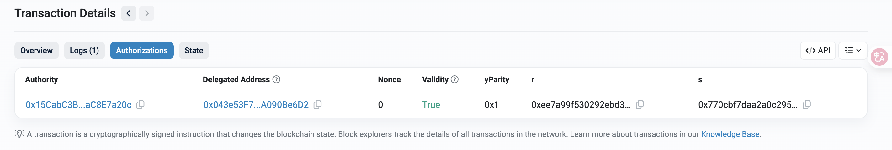

# Пример реализации EIP-7702

Этот проект демонстрирует как прикрепить код смарт-контракта к EOA (Externally Owned Account) согласно стандарту [EIP-7702](https://eips.ethereum.org/EIPS/eip-7702) с использованием библиотеки [viem](https://viem.sh/).

Стандарт EIP-7702 появился с обновлением Pectra.

### Основные компоненты

- **EOA аккаунт** - аккаунт, к которому будет прикрепляться код смарт-контракта
- **Relay аккаунт** - аккаунт, который отправляет транзакции в сеть от имени EOA
- **Delegation контракт** - код, который будет прикреплен к EOA

### Процесс работы

1. EOA подписывает разрешение на прикрепление кода
2. Relay отправляет транзакцию с подписью EOA
3. Код прикрепляется к EOA через EIP-7702, который уже реализован внутри viem

## Подготовка к работе

### Требования

- Node.js v22.15.0
- Тестовая сеть Sepolia
- Небольшое количество SepoliaETH для транзакций

### Установка

```bash
npm ci
```

### Настройка

Создайте файл `.env` на основе `.env.example`:
```bash
# Аккаунт, который будет отправлять транзакции в сеть
RELAY_PRIVATE_KEY=0x..

# EOA аккаунт, к которому будет прикреплен код смарт-контракта Delegation.sol
EOA_PRIVATE_KEY=0x...

# Адрес контракта для прикрепления
CONTRACT_ADDRESS=0x043e53F72a0840563087661E9983C5cA090Be6D2
```

## Использование

### Прикрепление кода к EOA

```bash
node scripts/addCodeToEOA.js
```

### Открепление кода от EOA

```bash
node ./scripts/removeCodeFromEOA.js
```

## Смарт-контракты

В примере используется смарт-контракт [`Delegation.sol`](./contract/Delegation.sol), который уже развернут в сети Sepolia по адресу `0x043e53F72a0840563087661E9983C5cA090Be6D2`.

Можно использовать этот готовый адрес или задеплоить собственную имплементацию.

### Проверка статуса

Чтобы проверить, прикреплен ли код к EOA аккаунту, можно использовать этот вспомогательный контракт: [Account Code Checker](https://sepolia.etherscan.io/address/0xA3C9961181BBc23dBbf7fb305aE844d1B4E55cF6#code)

## Примеры

Пример успешной транзакции по прикреплению кода к EOA: [0xac853a22056e6eb28afe523aa6c7144fbe5d07a40d633c505ea0a4d6f69e8ed7](https://sepolia.etherscan.io/tx/0xac853a22056e6eb28afe523aa6c7144fbe5d07a40d633c505ea0a4d6f69e8ed7)


Также вместе с транзакцией появляется вкладка `authorization`.

